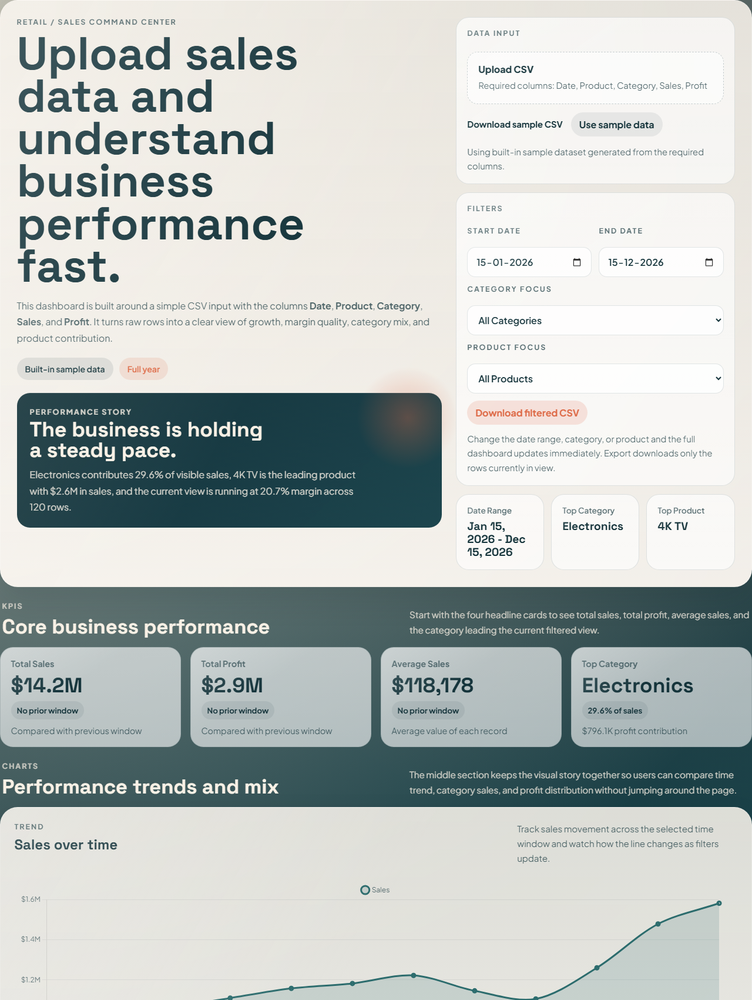
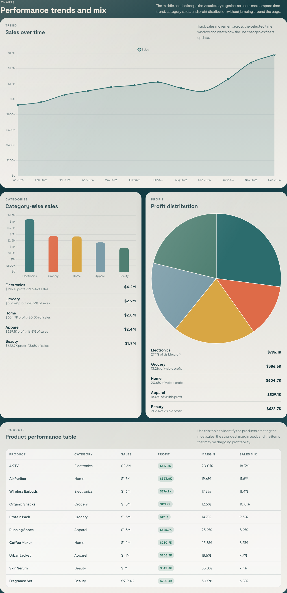
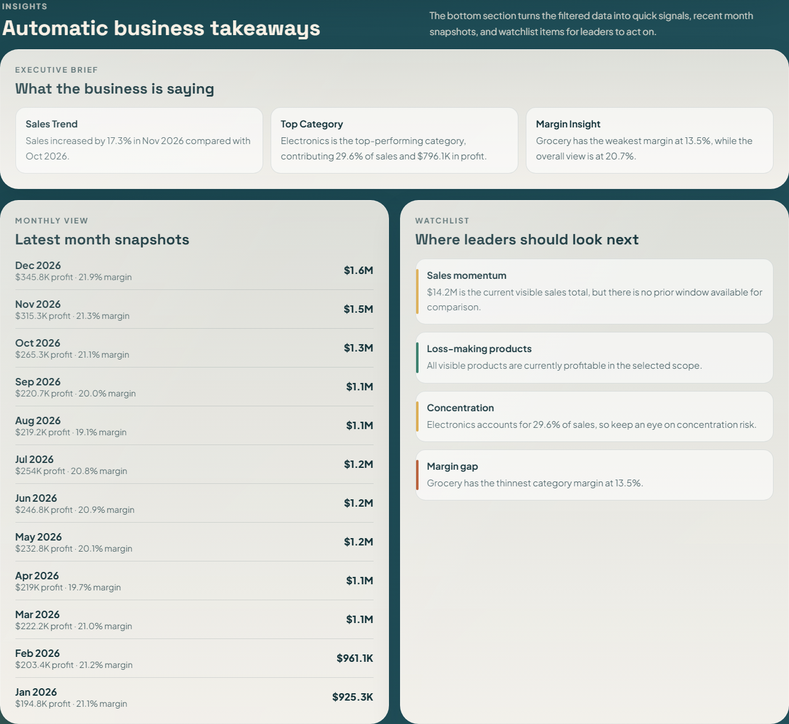

# Retail Pulse Dashboard

Retail Pulse Dashboard is a clean business dashboard for a retail or sales company. It helps users understand business performance from a simple CSV file by turning raw rows into KPI cards, charts, product rankings, and automatic insights.

## Screenshots

Top section



Charts section



Insights section



Full-page reference: [screenshots/dashboard-overview.png](screenshots/dashboard-overview.png)

## Features

- CSV upload with required columns: `Date`, `Product`, `Category`, `Sales`, `Profit`
- KPI cards for Total Sales, Total Profit, Average Sales, and Top Category
- Dynamic filters for date range, category, and product
- Sales over time line chart
- Category-wise sales bar chart
- Profit distribution pie chart
- Automatically generated business insights
- Product performance table
- Watchlist section for leadership follow-up
- Export of the filtered dataset as CSV
- Responsive layout with clear sections: KPIs at the top, charts in the middle, insights at the bottom

## Tech Stack

- `HTML`
- `CSS`
- `JavaScript`
- `Chart.js`

## Project Structure

- `index.html` - dashboard layout and sections
- `styles.css` - dashboard styling and responsive layout
- `app.js` - CSV parsing, filters, KPI logic, charts, insights, and export
- `sample-sales-data.csv` - sample dataset for quick testing
- `screenshots/` - dashboard screenshots used in this README

## Run Locally

1. Open `index.html` in a browser.
2. Use the built-in sample data or upload your own CSV.
3. Apply filters to explore the business view.
4. Export the filtered rows when needed.

No build step is required.

## CSV Format

The uploaded CSV must include these columns:

| Column | Description |
| --- | --- |
| `Date` | Transaction or reporting date |
| `Product` | Product name |
| `Category` | Product category |
| `Sales` | Sales value |
| `Profit` | Profit value |

Example:

```csv
Date,Product,Category,Sales,Profit
2026-01-15,4K TV,Electronics,190000,36860
2026-01-15,Running Shoes,Apparel,98000,25970
2026-01-15,Coffee Maker,Home,91000,20800
```

## Dashboard Sections

### 1. KPIs

Shows the headline business metrics:

- Total Sales
- Total Profit
- Average Sales
- Top Category

### 2. Charts

Shows the required business visuals:

- Sales over time
- Category-wise sales
- Profit distribution

All charts update automatically when filters change.

### 3. Insights

Generates automatic observations from the filtered data, such as:

- Sales increased compared with the previous period
- The top-performing category in the current view
- Margin or profitability warnings for weaker areas

## Filters

Users can filter the dashboard by:

- Start date
- End date
- Category
- Product

Every dashboard section updates dynamically after a filter change.

## Export

Use the `Download filtered CSV` button to export only the rows visible in the current filtered view.

## Performance

The dashboard is designed to handle around `1,000` rows smoothly. Filter updates are batched and chart instances are reused so interactions stay responsive for the target dataset size.

## Notes

- If no CSV is uploaded, the dashboard loads a built-in sample dataset.
- The charts use the Chart.js CDN. An internet connection helps load charts in the default setup.
